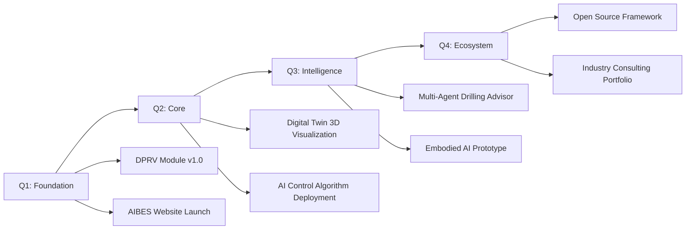

<div align="center">

<!-- AIBES Brand Header -->


<!-- Typing Animation -->
[](https://git.io/typing-svg)

</div>

---

<!-- Profile Views Counter -->
<div align="right">
  
</div>

## 🧭 Richard Chikun Cui | 崔驰坤

> **"Architecture is the bridge between business intent and technical reality."**

**Chief Architect & Founder @ AIBES (艾博晟咨询)**  
*AI Business Enablement Strategy — 架构 · 研究 · 咨询 · 视野*

- 🏗️ **20+ years** in enterprise software architecture (Accenture → Independent)
- 🛢️ **Domain Expert** in drilling engineering visualization & intelligent MPD systems
- 🤖 **AI Practitioner** exploring LLM engineering, digital twins, embodied intelligence
- 🎯 **Mission**: Empower traditional industries with AI-native architecture

---

## 🔗 Identity Matrix

| Platform | Handle | Focus |
|----------|--------|-------|
| **GitHub** | `aibes-arch` | Open-source projects & architecture experiments |
| **Primary** | `aibes` | Brand & strategy |
| **Architecture** | `aibes.arch` | System design & tech content |
| **Engineering** | `aibes_arch` | Code & implementation |
| **Website** | [aibes.cn](https://aibes.cn) | Consulting & portfolio |

---

## 🏛️ AIBES Architecture Cube

```
                    ┌──────────────────┐
                    │    HORIZON       │  ← Future Tech Radar
                    │  (AI/具身智能/    │     Embodied AI |
                    │   数字孪生)       │     Digital Twin
                    └────────┬─────────┘
                             │
    ┌────────────┐    ┌────┴────┐    ┌────────────┐
    │ ARCHITECTURE│◄──►│  AIBES  │◄──►│  RESEARCH   │
    │   架构       │    │  艾博晟  │    │   研究       │
    │Systems/    │    │         │    │Algorithms/ │
    │Platforms   │    │ CONSULTING    │    │Models/     │
    └────────────┘    │   咨询       │    └────────────┘
                      │Strategy/   │
                      │Enablement  │
                      └─────────────┘
```

| Dimension | Chinese | Core Capability | Current Focus |
|-----------|---------|----------------|---------------|
| 🏗️ **Architecture** | 架构 | Enterprise system design, microservices, event-driven architecture | Web-based drilling digital twin platform |
| 🔬 **Research** | 研究 | AI algorithms, physics-informed ML, multi-agent systems | Intelligent MPD control algorithms (PID/MPC/RL) |
| 💼 **Consulting** | 咨询 | Digital transformation strategy, technical due diligence | Oil & gas industry AI adoption roadmap |
| 🌅 **Horizon** | 视野 | Emerging tech scouting, future-proof architecture | Embodied AI, Vibe Coding, AI-native dev workflows |

---

## 🛠️ Tech Arsenal

### Core Stack
```python
class TechStack:
    backend = ["Python 3.11", "FastAPI", "SQLAlchemy", "Celery"]
    frontend = ["Vue 3", "TypeScript", "Three.js", "Element Plus"]
    database = ["MySQL 8.0", "InfluxDB", "Redis", "RabbitMQ"]
    ai_ml = ["PyTorch", "TensorFlow", "Scikit-learn", "Transformers"]
    devops = ["Docker", "Kubernetes", "Nginx", "GitHub Actions"]
    embedded = ["ROS2", "MQTT", "Modbus", "CAN Bus"]
```

### Skill Badges
<p align="center">
  <!-- Languages -->
  
  
  
  
  <br/>
  <!-- Frameworks -->
  
  
  
  
  <br/>
  <!-- Infrastructure -->
  
  
  
  
</p>

---

## 🚀 Active Projects

### 🛢️ [Drilling Process Recognition & Visualization](https://github.com/aibes-arch/DPRV)
**Drilling Process Recognition & Visualization Module**
> Vue3 + FastAPI + MySQL + Three.js

- Real-time wellbore monitoring with WebSocket data streaming
- Intelligent control algorithms for choke valve automation
- Digital twin simulation with 10+ drilling scenario models
- 3D wellbore visualization using Three.js

```
Status: ████████████░░░░ 75% | Phase 5/8: AI Decision Module
```

### 🤖 [AIBES-Embodied-Stack](https://github.com/aibes-arch/Embodied-Stack)
**Embodied AI Learning & Teleoperation Framework**
> Python + ROS2 + PyTorch + 3D Printing

- Open-source teleoperation arm with 3D-printed components
- Sensorimotor learning pipeline for robotic manipulation
- Integration with LLM for natural language task planning

```
Status: ██████░░░░░░░░░░ 35% | Phase 2/5: Hardware Integration
```

### 🧠 [AIBES-Knowledge-Base](https://github.com/aibes-arch/Knowledge-Base)
**AI Engineering Knowledge Repository**

- Prompt Engineering → Context Engineering → Loop Engineering → Agentic Engineering → Harness Engineering → Vibe Coding
- Industrial AI case studies (drilling, manufacturing, energy)
- Architecture patterns for AI-native applications

---

## 📊 GitHub Analytics

<div align="center">

<!-- GitHub Stats -->


<!-- Streak Stats -->


<!-- Contribution Graph -->


</div>

---

## 🎯 2026 Roadmap



| Quarter | Milestone | Deliverable |
|---------|-----------|-------------|
| **Q1** | Foundation | DPRV core modules (monitoring + control) |
| **Q2** | Core | Digital twin 3D visualization + AI prediction models |
| **Q3** | Intelligence | Multi-agent decision system + embodied AI prototype |
| **Q4** | Ecosystem | Open-source framework release + consulting cases |

---

## 🏆 Professional DNA

```yaml
richard_chikun_cui:
  born: "1982-12-30 19:35"
  origin: "Jilin City, Jilin Province, China"
  ancestry: "Shandong Qinghe Commandery (山东清河郡)"

  career:
    - period: "2006-2015"
      company: "Dalian Huaxin Computer Technology"
      role: "IT Service Department Technical Lead"
    - period: "2015-2023"
      company: "Accenture (Dalian) Information Technology"
      role: "Technical Architecture Delivery Manager"
    - period: "2023-Present"
      company: "AIBES Consulting (艾博晟咨询)"
      role: "Founder & Chief Architect"

  education:
    degree: "B.S. Software Engineering"
    institution: "Jilin University Software College"
    period: "2002-2006"

  domains:
    - "Drilling Engineering Visualization"
    - "Managed Pressure Drilling (MPD) Systems"
    - "Enterprise Microservices Architecture"
    - "AI-Native Application Development"

  equipment:
    workstation: "Titan (Greek Mythology Series)"
    laptop: "Hermes (Greek Mythology Series)"

  philosophy: 
    - "Architecture is frozen music, and code is executable architecture."
    - "From Prompt Engineering to Vibe Coding — the evolution of human-AI collaboration."
```

---

## 📡 Connect

<div align="center">

<!-- Social Badges -->
<a href="https://aibes.cn">
  
</a>
<a href="mailto:contact@aibes.cn">
  
</a>

<br/><br/>

<!-- Platform Matrix -->
| Platform | ID | QR/Link |
|----------|-----|---------|
| **Website** | [aibes.cn](https://aibes.cn) | 🌐 |
| **GitHub** | `aibes-arch` | ⬇️ |
| **Architecture** | `aibes.arch` | 🏗️ |
| **Engineering** | `aibes_arch` | ⚙️ |
| **Brand** | `aibes` | 🎯 |

</div>

---

<div align="center">

<!-- Footer Wave -->


**"Building the architecture that enables AI to serve business."**

*AIBES — AI Business Enablement Strategy | 艾博晟咨询*

</div>
